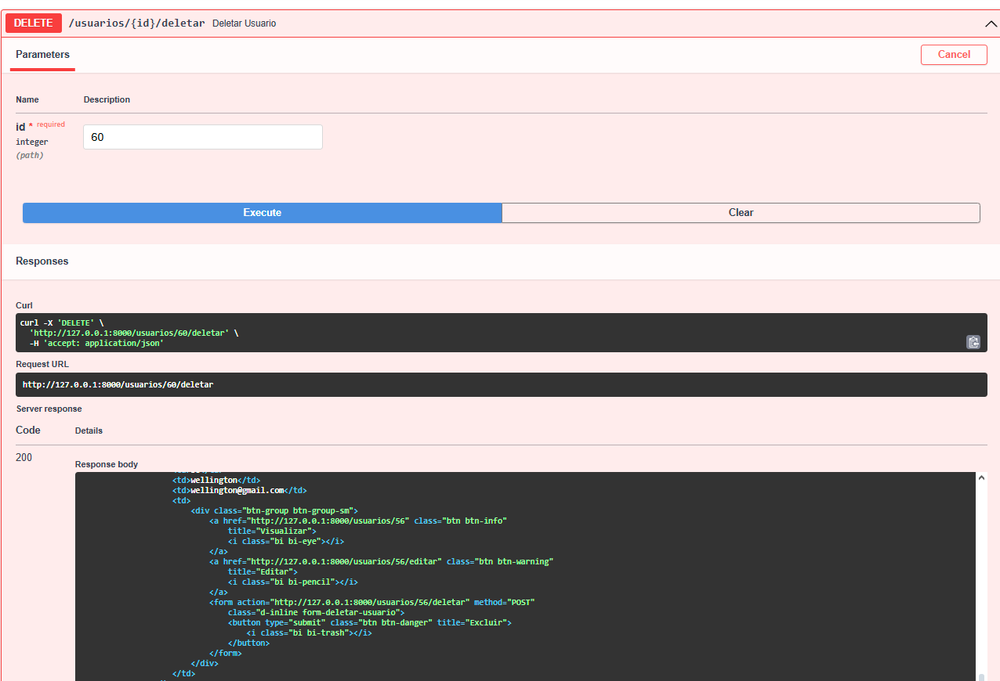

# 🚀 Sistema de Gestão de Produtos e Usuários


## 📌 Visão Geral

Sistema completo para gerenciamento de produtos e usuários com API RESTful e interface web, desenvolvido em Python com FastAPI e MySQL.

---

## 🛠️ Stack Tecnológica

- **Backend**: FastAPI (Python 3.8+)
- **Banco de Dados**: MySQL (MySQL Workbench)
- **ORM**: SQLAlchemy
- **Templates**: Jinja2
- **Validação**: Pydantic

---

## 🏗️ Estrutura do Projeto

```
projeto_gestao/
├── controllers/
│   ├── produto_controller.py    # Lógica para produtos
│   └── usuario_controller.py    # Lógica para usuários
│
├── database/
│   ├── config.py                # Configurações do banco
│   └── models/
│       ├── database.py          # Configuração do ORM
│       ├── produto_model.py     # Modelo de produtos
│       └── usuario_model.py     # Modelo de usuários
│
├── routes/
│   ├── produtos_routes.py       # Rotas de produtos
│   └── usuario_routes.py        # Rotas de usuários
│
├── templates/
│   ├── produtos/
│   │   ├── cadastro.html        # Formulário de cadastro
│   │   ├── detalhes.html        # Visualização de produto
│   │   ├── editar.html          # Formulário de edição
│   │   └── lista.html           # Listagem de produtos
│   │
│   ├── usuarios/
│   │   ├── cadastro.html        # Formulário de usuário
│   │   ├── detalhes.html        # Perfil de usuário
│   │   ├── editar.html          # Edição de usuário
│   │   └── lista.html           # Lista de usuários
│   │
│   ├── base.html                # Template base
│   └── index.html               # Página inicial
│
├── validators/                  # Validações customizadas
├── testes_endpoint/             # Evidências de testes
├── .env.example                 # Variáveis de ambiente
├── main.py                      # Aplicação principal
├── README.md                    # Documentação
└── requirements.txt             # Dependências
```

---

## 🔄 Fluxo de Dados

1. **Requisição** chega à rota correspondente
2. **Controller** processa a requisição
3. **Model** interage com o banco via SQLAlchemy
4. **Resposta** é renderizada (HTML) ou retornada (JSON)

---

## ✅ Validações Implementadas

| Entidade  | Campo          | Validações                              |
|-----------|----------------|-----------------------------------------|
| Produto   | nome           | Obrigatório, 3-100 caracteres           |
|           | preço          | Decimal positivo                        |
|           | quantidade     | Inteiro não negativo                    |
| Usuário   | email          | Formato válido, único no sistema        |
|           | senha          | Mínimo 8 caracteres                     |

---

## 🧪 Testes de Endpoint

### 🛍️ Módulo de Produtos

| Método | Endpoint               | Casos Testados | Evidência |
|--------|------------------------|----------------|-----------|
| GET    | `/produtos`            | Listagem completa |  |
| GET    | `/produtos/[id]`       | Produto específico |  |
| POST   | `/produtos`            | Criação com validação | .png) |
| PUT    | `/produtos/[id]`       | Atualização parcial | .png) |
| DELETE | `/produtos/[id]`       | Exclusão segura |  |

### 👥 Módulo de Usuários

| Método | Endpoint               | Casos Testados | Evidência |
|--------|------------------------|----------------|-----------|
| GET    | `/usuarios`            | Listagem completa |  |
| GET    | `/usuarios/[id]`       | Usuário específico |  |
| POST   | `/usuarios`            | Registro com validação | .png) |
| PUT    | `/usuarios/[id]`       | Atualização de perfil | .png) |
| DELETE | `/usuarios/[id]`       | Remoção de conta |  |

---

## 🚀 Como Executar

1. **Pré-requisitos**:
   - Python 3
   - MySQL Server
   - MySQL Workbench

2. **Configuração**:
   ```bash
   # Clonar repositório
   git clone [URL_DO_REPOSITORIO]
   
   # Configurar ambiente
   cp .env.example .env
   # Editar .env com suas credenciais MySQL
   
   # Instalar dependências
   pip install -r requirements.txt
   ```

3. **Execução**:
   ```bash
   uvicorn main:app --reload
   ```

Acesse a API em `http://localhost:8000` e a documentação interativa em `http://localhost:8000/docs`

---

## 👥 Autores

- [Autor 1](https://github.com/autor1)
- [Autor 2](https://github.com/autor2)

---

<div align="center">
  Desenvolvido com Python 🐍 e FastAPI ⚡ 
</div>